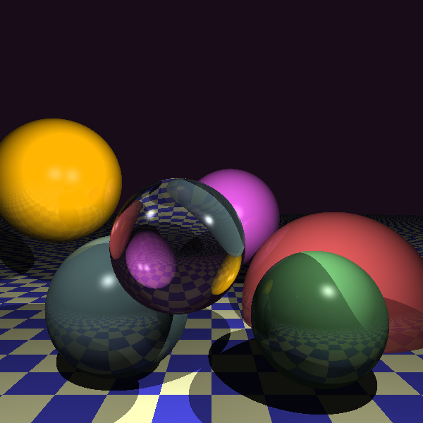
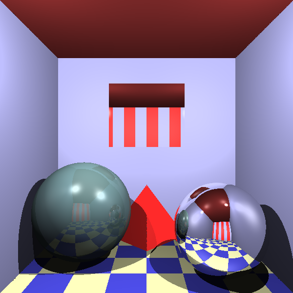

#  Компьютерная графика (Задание 1) 

## Сборка:
```bash
$ mkdir build
$ cd build
$ cmake -DCMAKE_BUILD_TYPE=Release ..
$ make -j 4
```
## Запуск:
```bash
$ ./rt -out <path> -scene <scene_number> -threads <number_of_threads>
```
## Реализованные пункты:
- База
    - Локальное освещение.
    - Тени.
    - Зеркальные отражения.
    - Различные материала.
    - Различные примитивы (сфера и плоскость).
    - Источники света.
	- Разрешение 600*600
- Дополнительно
	- Треугольник (+1)
	- Текстуры (+1)
	- Преломления (+1)
	- Многопоточность (+2)
	
### Примеры: 

